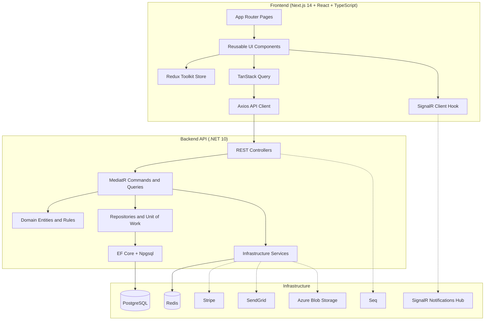

# DealHive - Deals Marketplace Platform

[](docs/SETUP.md)
[](frontend)
[](backend)
[](docker-compose.yml)

**DealHive** is a Groupon-style deals marketplace for discovering, buying, and redeeming discounted local offers. It includes a customer-facing storefront, account area, cart and checkout flow, vendor portal, admin dashboard, voucher management, reviews, wishlist support, and real-time notifications.

> This project is under active development. Some workflows, tests, and production integrations may still need hardening before a public launch.

---

## Architecture Overview

DealHive uses a feature-oriented Next.js frontend backed by a layered .NET API. The backend follows a Domain, Application, Infrastructure, and API split, with MediatR handlers coordinating business workflows and EF Core handling PostgreSQL persistence.



### Key Design Decisions

- **Clean Architecture project split** - API, Application, Domain, and Infrastructure projects keep HTTP, business logic, entities, and integrations separated.
- **MediatR request pipeline** - commands and queries run through validation, logging, and performance behaviors.
- **PostgreSQL persistence** - EF Core migrations and Npgsql back the core marketplace data model.
- **Redis-backed caching** - shared cache service supports faster repeated reads and infrastructure-friendly scaling.
- **JWT authentication** - role policies support admin, vendor, and consumer workflows.
- **SignalR notifications** - `/hubs/notifications` powers real-time client updates.
- **External service boundaries** - Stripe, SendGrid, and Azure Blob Storage are wrapped behind application interfaces.

---

## Key Highlights

- **Deal discovery and browsing** - category pages, search, local deals, travel, goods, gift, wishlist, and featured deal experiences.
- **Checkout and payments** - cart, order creation, Stripe payment integration, and voucher issuance flow.
- **Voucher lifecycle** - customer voucher list, order detail pages, redemption support, and unique voucher code generation.
- **Vendor portal** - vendor registration, dashboard, deal creation/editing, order management, and deal submission workflows.
- **Admin dashboard** - admin views for deals, vendors, orders, approvals, and marketplace oversight.
- **Account management** - login, registration, password reset, profile, orders, saved deals, and notifications.
- **Operational tooling** - Docker Compose starts PostgreSQL, Redis, Seq, API, and frontend services together.

---

## Technology Stack

| Layer | Technologies Used |
| :--- | :--- |
| **Frontend** | Next.js 14, React 18, TypeScript, Tailwind CSS, Redux Toolkit, TanStack Query, Axios, React Hook Form, Zod, Framer Motion, Radix UI, lucide-react |
| **Backend** | .NET 10 Web API, C#, MediatR, FluentValidation, AutoMapper, Serilog, Swagger/OpenAPI |
| **Database** | PostgreSQL, EF Core 10, Npgsql |
| **Caching** | Redis, StackExchange.Redis |
| **Realtime** | SignalR |
| **Authentication** | ASP.NET Core Identity, JWT Bearer tokens |
| **Payments** | Stripe |
| **Email** | SendGrid |
| **Storage** | Azure Blob Storage |
| **Observability** | Serilog, Seq |
| **Testing** | Jest, Playwright, .NET test tooling |

---

## Repository Directory Structure

```text
DealHive/
|-- .claude/                # Claude/Codex project context
|-- docs/                   # Setup, deployment, API, UX/UI, and AI prompt docs
|   |-- api/
|   |   `-- API_REFERENCE.md
|   |-- ux-ui/
|   |   `-- UX_UI_SPEC.md
|   |-- SETUP.md
|   `-- DEPLOYMENT.md
|-- frontend/               # Next.js + TypeScript application
|   |-- src/app/            # App Router pages and route groups
|   |-- src/components/     # Layout, deal, provider, and UI components
|   |-- src/hooks/          # Client hooks, including SignalR integration
|   |-- src/lib/            # API client and utilities
|   `-- src/store/          # Redux store and slices
|-- backend/                # .NET solution and API source
|   |-- DealHive.sln
|   |-- seed.sql
|   |-- beauty_spas_groupon_seed.sql
|   `-- src/
|       |-- API/             # Controllers, middleware, hubs, Program.cs
|       |-- Application/     # Features, commands, queries, interfaces, behaviors
|       |-- Domain/          # Entities, enums, domain events, exceptions
|       `-- Infrastructure/  # EF Core, repositories, identity, cache, external services
|-- docker-compose.yml       # Local full-stack environment
|-- docker-compose.override.yml
|-- .env.example
`-- README.md
```

---

## Getting Started

### Prerequisites

- [.NET 10 SDK](https://dotnet.microsoft.com/)
- [Node.js 20+](https://nodejs.org/) and npm
- [Docker Desktop](https://www.docker.com/products/docker-desktop/) for PostgreSQL, Redis, Seq, and containerized app runs
- Stripe test keys for checkout flows
- SendGrid account for email delivery
- Azure Storage account for media upload flows

### 1. Clone

```bash
git clone https://github.com/<your-org>/dealhive.git
cd dealhive
```

### 2. Configure Environment

```bash
cp .env.example .env
```

Fill in real local or sandbox values for:

- `POSTGRES_PASSWORD`
- `REDIS_PASSWORD`
- `JWT_SECRET`
- `STRIPE_SECRET_KEY`
- `STRIPE_PUBLISHABLE_KEY`
- `STRIPE_WEBHOOK_SECRET`
- `SENDGRID_API_KEY`
- `AZURE_STORAGE_CONNECTION_STRING`
- `NEXT_PUBLIC_API_URL`
- `NEXT_PUBLIC_SIGNALR_URL`

### 3. Start with Docker Compose

```bash
docker-compose up --build
```

Local services:

| Service | URL |
| :--- | :--- |
| Frontend | http://localhost:3000 |
| API | http://localhost:5000 |
| Swagger UI | http://localhost:5000/swagger |
| Seq Logs | http://localhost:5341 |
| PostgreSQL | localhost:5432 |
| Redis | localhost:6379 |

### 4. Backend Setup Without Docker

```bash
cd backend
dotnet restore DealHive.sln

cd src/API
dotnet ef database update --project ../Infrastructure
dotnet run
```

The API starts at `http://localhost:5000` by default. Swagger is available at `http://localhost:5000/swagger` in development.

### 5. Frontend Setup Without Docker

```bash
cd frontend
npm install
npm run dev
```

The frontend starts at `http://localhost:3000`.

---

## Environment Variables

The root `.env.example` file documents the expected local configuration. Keep real secrets in `.env` or a secrets manager and do not commit them.

| Area | Variables |
| :--- | :--- |
| **Database** | `POSTGRES_PASSWORD` |
| **Redis** | `REDIS_PASSWORD` |
| **JWT** | `JWT_SECRET`, `JWT_ISSUER`, `JWT_AUDIENCE` |
| **Stripe** | `STRIPE_SECRET_KEY`, `STRIPE_PUBLISHABLE_KEY`, `STRIPE_WEBHOOK_SECRET` |
| **SendGrid** | `SENDGRID_API_KEY`, `SENDGRID_FROM_EMAIL` |
| **Azure Storage** | `AZURE_STORAGE_CONNECTION_STRING`, `AZURE_STORAGE_CONTAINER` |
| **Frontend** | `FRONTEND_URL`, `NEXT_PUBLIC_API_URL`, `NEXT_PUBLIC_SIGNALR_URL` |
| **ASP.NET Core** | `ASPNETCORE_ENVIRONMENT` |

---

## Testing

### Backend

```bash
cd backend
dotnet test DealHive.sln
```

### Frontend

```bash
cd frontend
npm run type-check
npm run lint
npm run test:ci
npm run test:e2e
```

---

## Development Workflow

```bash
git checkout -b feat/<scope>

# Backend
cd backend
dotnet format
dotnet test DealHive.sln

# Frontend
cd frontend
npm run type-check
npm run lint
npm run test:ci
```

Use conventional commits where practical:

```bash
git commit -m "feat(deals): add featured deals carousel"
git commit -m "fix(auth): preserve refresh token on reload"
git commit -m "docs(readme): update local setup"
```

---

## Documentation

| Doc | Purpose |
| :--- | :--- |
| [docs/SETUP.md](docs/SETUP.md) | Local development setup and useful commands |
| [docs/DEPLOYMENT.md](docs/DEPLOYMENT.md) | Production deployment notes and CI/CD outline |
| [docs/api/API_REFERENCE.md](docs/api/API_REFERENCE.md) | REST API endpoint reference |
| [docs/ux-ui/UX_UI_SPEC.md](docs/ux-ui/UX_UI_SPEC.md) | UX/UI product and interface specification |
| [docs/AI_PROMPTS.md](docs/AI_PROMPTS.md) | AI prompt references for the project |

---

## Seed Data

The backend folder includes SQL seed files for local development:

```text
backend/seed.sql
backend/beauty_spas_groupon_seed.sql
```

Apply these only against local or disposable development databases unless you have reviewed the data and constraints for your environment.

---

## Project Status

**MVP in active development.** The repository contains the core storefront, API, vendor, admin, payment, notification, and voucher building blocks. Before production launch, review environment secrets, payment webhooks, email templates, storage permissions, observability, test coverage, and deployment settings.

## License

Proprietary - All rights reserved.
